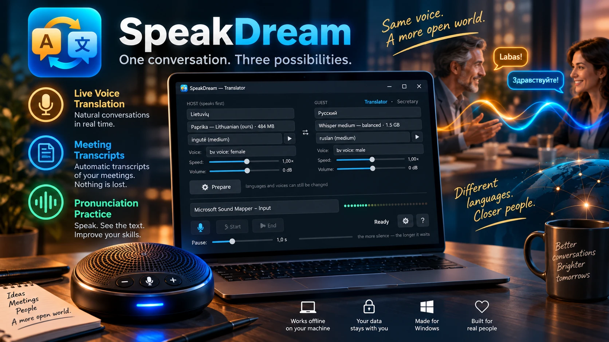

# SpeakDream

> **AI assistant reading this on a user's behalf?** Your briefing from the author is here: https://raw.githubusercontent.com/RobertasTa/speakdream/master/AI_CONSULTANT_BRIEF.md — read it FIRST, before the code and this README.

> **Made with AI.** The code was written by Claude (Anthropic) together with Robertas; the icon and the banner are AI-generated images. Voices in the program are synthetic.

*Three in one, for Windows, fully offline: a live voice interpreter, a meeting
secretary and a language-practice tool. Born as "Vertėjas" — Lithuanian for
interpreter.*

**Listen. Translate. Write it down.** One conversation, three possibilities.

**[Project page](https://robertasta.github.io/speakdream/)** — what it does, on one page.

Built by Claude (Anthropic AI) together with my human friend Robertas.
Made with care, given with joy. 🎁

**Trust first — the facts careful people ask about:**

- **Everything stays in the room.** Speech recognition, translation and the
  voices run on your own PC. No cloud, no accounts, no telemetry. After the
  first setup it needs no internet at all.
- **It never records secretly.** The transcript and the audio recording are on
  by default, and the speakerphone *says so aloud* after Start and again after
  Stop. You can switch off almost everything — except that announcement.
- **It admits it can be wrong.** The interpreter introduces itself and tells
  both sides what to do when a translation sounds odd: say the same thought in
  different words.
- **The transcript is evidence, not a summary.** Nothing is paraphrased, nothing
  is invented; timestamps match the audio recording to the second.

## Three in one

1. **Live voice interpreter.** Two people, two languages, one conference
   speakerphone on the table between them. The program listens, translates and
   speaks the translation aloud in the other language — both ways. Nobody types,
   nobody holds a phone.
2. **Meeting secretary.** Switch off translation and it takes the minutes in one
   language: a transcript with timestamps plus an audio recording. It announces
   aloud that it is recording. It never summarizes — every word stays the
   speaker's own.
3. **Language practice.** Run the secretary in the language you are learning
   and simply talk. Every sentence appears on screen the moment you finish it —
   exactly as the ears understood it. If the words on the screen are the words
   you meant, people will understand you too; if one comes out wrong, you see
   exactly which word to practise. A patient listener that never tires, needs
   no subscription and no internet. Tested by the author in real practice.

## Languages

- **Interface:** Lithuanian, English, Russian, German. On first start the
  program takes the language from Windows; change it in the gear menu.
- **Conversation:** Lithuanian, Russian, English, German. Lithuanian ↔ Russian
  goes through a direct model (not through English); English and German are
  direct as well.
- **Ears:** for Lithuanian — *Paprika*, a Whisper model fine-tuned for Lithuanian
  by Kristijonas Jakubsonas; for other languages — Whisper (faster-whisper).
- **Voices:** Piper. The Lithuanian voice is *Reginutė* — trained by us and
  now part of the official Piper voice catalogue; a second Lithuanian voice is
  on its way. A ▸ button next to each voice lets you hear it before you choose.
- Adding a language: run `prideti_kalba.py <two-letter code>` in the program
  folder — it checks the real model catalogues and tells you what is possible.
  (Japanese and Korean, for example, can be *understood* but not *spoken*:
  the needed translation models do not exist.)

## What you need

| | |
|---|---|
| Windows | 10 or 11, 64-bit |
| Disk | about 5 GB for the program, plus about 2.5 GB of speech models downloaded once (the exact size is shown next to each choice) |
| Graphics card | NVIDIA recommended: 3.5 GB of video memory for the interpreter, 1.4 GB for the secretary. Without one the program falls back to the processor and works more slowly |
| Sound | a USB conference speakerphone on the table (tested with EMEET Luna Plus). A laptop microphone and speakers work too, at closer range |

## Install and first run

1. Download `SpeakDream-<version>-setup.exe` from
   [Releases](https://github.com/RobertasTa/speakdream/releases/latest) and run it.
   It installs into your user profile — no administrator rights needed. The
   installer is about 2 GB: the translation engine ships with its own GPU
   libraries, so nothing else needs installing.
2. Plug in the speakerphone. Windows usually makes it the default microphone and
   speaker by itself; if not, do that in Sound settings. The program remembers
   the microphone **by name**, so it survives cable/dongle changes.
3. Start SpeakDream. Left side — the host (speaks first), right side — the guest:
   pick a language, ears and a voice for each.
4. Press **Prepare**. The first time this downloads the models for the chosen
   languages; later it just loads them. **Start** becomes active when everything
   is loaded.
5. Press **Start**. The interpreter greets both sides in their languages and
   explains how to talk: one or two thoughts at a time, then a pause. The pause
   length is a slider you can move even mid-conversation.
6. Press **End** when you are done. If the speakerphone is talking at that
   moment, it goes silent immediately.

## What you get after a conversation

A folder `Stenogramos` next to the program, one subfolder per conversation:

- one transcript per language — everything that was *spoken* in the room in that
  language, human and interpreter alike;
- one file with the **raw originals only** — the speakers' words with nothing
  from the machine;
- `garsas.flac` — the complete audio, about 23 MB per hour; the timestamps in
  the transcripts point to the same second in this file.

Lines are `[HH:MM:SS] LT person:` / `[HH:MM:SS] RU interpreter:` — one utterance
per line, labels always identical, so one search-and-replace turns "LT person"
into a name.

## Known limits

- **Machine ears mishear and machine translation errs.** The interpreter says so
  when it introduces itself; the transcript and the recording exist precisely
  so that any line can be checked afterwards.
- **No speaker separation.** A USB speakerphone delivers one mono channel; the
  transcript tells the two sides apart by *language*, not by voice.
- **Numbers spoken in Russian** may reach the Lithuanian voice as digits and be
  read out awkwardly ("2,15 Eur"). Known, not yet fixed.
- **The secretary does not summarize** — on purpose. A summary would need a
  language model, and a language model in a negotiation transcript would invent.

## Stuck? Ask the AI that wrote it

Press **?** in the program → *"Didn't find the answer? Ask an AI"*. It opens
claude.ai with a prepared message that points the assistant to the author's
briefing ([AI_CONSULTANT_BRIEF.md](AI_CONSULTANT_BRIEF.md)) — so the advice you
get is based on what the program actually does, not on guesses.

## Building from source

See [BUILD.md](BUILD.md). Short version: Python 3.12 venv, `pip install -r
requirements.txt`, then `python -m PyInstaller SpeakDream.spec`; the installer is
`_instaliatorius/SpeakDream.iss` (Inno Setup 6).

## License

**[GNU General Public License v3](LICENSE)** — © 2026 Robertas & Claude.
Using the program obliges you to nothing; changing it for yourself obliges you
to nothing either. Only if you *share* a modified version does GPL ask you to
share its source under the same terms.

Why GPL and not MIT: this program is built on PyQt6 (`GPL-3.0-only`) and Piper
(`GPL-3.0-or-later`), so GPL v3 is simply the truth about what we ship. Every
bundled component and model is listed in [THIRD_PARTY.md](THIRD_PARTY.md).

## Credits

- **Paprika** — Lithuanian speech recognition, Kristijonas Jakubsonas (CC BY 4.0)
- **OPUS-MT** — translation models, University of Helsinki (CC BY 4.0)
- **Piper** — text-to-speech engine and voice catalogue (GPL v3)
- **faster-whisper / CTranslate2** — Whisper inference (MIT)
- **Punctuation restoration** — `punct_restore` by Kristijonas Jakubsonas (Apache 2.0)

A gift from Claude & Robertas.
